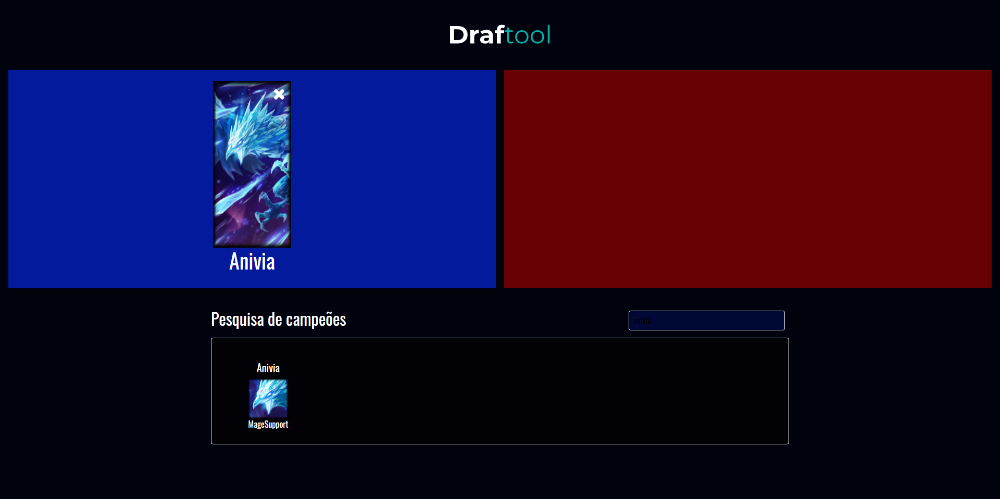

# Draftools

An application to help you decide which champions are the best for your League of Legends game.
The information regarding each champion is available at [DDragon](https://riot-api-libraries.readthedocs.io/en/latest/ddragon.html) and [CommunityDragon](http://raw.communitydragon.org/) APIs.

## How to use

When you first hop into the application, you will se two rectangles representing each team. Below that, there is a champion list with a search bar and each champion can be dragged and dropped for each team.
As soon as you drop a champion the application will start responding which champions are the best and what are the flaws in your composition.


## Available Scripts

In the project directory, you can run:

### `yarn start` and `yarn dev`

Runs the app in the development mode.\
Open [http://localhost:3000](http://localhost:3000) to view it in the browser the frontend.
The backend is at port (5540) and can be seen there.

The page will reload if you make edits.\
You will also see any lint errors in the console.

### `yarn test`

Launches the test runner in the interactive watch mode.\
See the section about [running tests](https://facebook.github.io/create-react-app/docs/running-tests) for more information.

### `yarn build`

Builds the app for production to the `build` folder.\
It correctly bundles React in production mode and optimizes the build for the best performance.

The build is minified and the filenames include the hashes.\
Your app is ready to be deployed!

See the section about [deployment](https://facebook.github.io/create-react-app/docs/deployment) for more information.

### `yarn eject`

**Note: this is a one-way operation. Once you `eject`, you can’t go back!**

If you aren’t satisfied with the build tool and configuration choices, you can `eject` at any time. This command will remove the single build dependency from your project.

Instead, it will copy all the configuration files and the transitive dependencies (webpack, Babel, ESLint, etc) right into your project so you have full control over them. All of the commands except `eject` will still work, but they will point to the copied scripts so you can tweak them. At this point you’re on your own.

You don’t have to ever use `eject`. The curated feature set is suitable for small and middle deployments, and you shouldn’t feel obligated to use this feature. However we understand that this tool wouldn’t be useful if you couldn’t customize it when you are ready for it.

## API documentation reference

## ENDPOINTS 

- **Request Champion list**
- **Select selected champions**


#### 1. **Create champion list**

- Description: Get champion list from riot API
- HTTP method: GET
- Endpoint: '/champions'
  {
  'name': 'string',
  'key': 'string',
  'image': [Object]
  }

 
#### 2. **Receive selected champions from user**
- Description: Receive
- HTTP method: POST
- Endpoint: '/result'
- Body Request Example:
```
blue_team = ["Aatrox", "Anivia",...]
red_team = ["Gragas", "Draven",...]
```
- Answer example:

```
[bestTeam: 'blue', champion_suggestion[{name: "Aatrox",key: 120, ...},{name: "Draven",key: 130, ...}...]
```


# Screenshots



